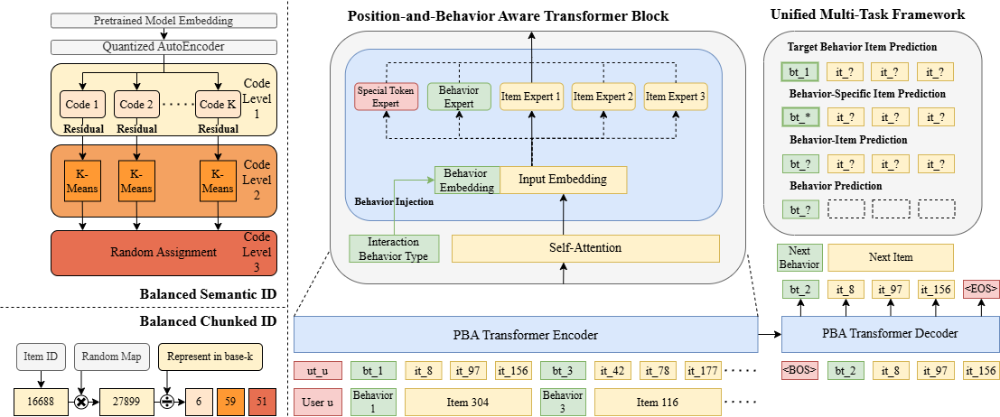

# MBGen

[](https://arxiv.org/abs/2405.16871)

MBGen models the multi-behavior sequential recommendation problem in a novel generative manner. Accepted to *CIKM 2024*.

See our paper: [Multi-Behavior Generative Recommendation](https://arxiv.org/abs/2405.16871)

## 🔍 Overview

Multi-behavior sequential recommendation (MBSR) aims to incorporate behavior types of interactions for better recommendations. Existing approaches focus on the next-item prediction objective, neglecting the value of integrating the target behavior type into the learning objective. In this paper, we propose MBGen, a novel Multi-Behavior sequential Generative recommendation framework. We formulate the MBSR task into a consecutive two-step process: (1) given item sequences, MBGen first predicts the next behavior type to frame the user intention, (2) given item sequences and a target behavior type, MBGen then predicts the next items. To model such a two-step process, we tokenize both behaviors and items into tokens and construct one single token sequence with both behaviors and items placed interleaved. Furthermore, MBGen learns to autoregressively generate the next behavior and item tokens in a unified generative recommendation paradigm, naturally enabling a multi-task capability. Additionally, we exploit the heterogeneous nature of token sequences in the generative recommendation and propose a position-routed sparse architecture to efficiently and effectively scale up models. Extensive experiments on public datasets demonstrate that MBGen significantly outperforms existing MBSR models across multiple tasks.



## 🚀 Quick Start

Download datasets from [here](https://drive.google.com/drive/folders/1G7tvIT1wvGZC2GmI-8Okbn9HrGQnNbfu?usp=sharing) and put the datasets into `./data/raw_dataset/`

Generated item IDs are located in `./tokenizer/ID/`. To generate a new set of item IDs, encode the prior of items into embeddings (through pre-trained embedding models/embedding table of pre-trained sequential recommendation models) and save the generated embedding as a tensor of size `num_items * embedding_dim` into `./tokenizer/embedding.pkl`.

To train the model with Retail dataset

SID:

```bash
python run.py --config=./config/SID/retail/main.yaml
```

CID:

```bash
python run.py --config=./config/CID/retail/main.yaml
```

To train the model with IJCAI dataset

SID:

```bash
python run.py --config=./config/SID/ijcai/main.yaml --dataset=ijcai
```

CID:

```bash
python run.py --config=./config/CID/ijcai/main.yaml --dataset=ijcai
```

## 🌟 Acknowledgement

Please cite the following paper if you find our code helpful.

```bibtex
@inproceedings{liu2024mbgen,
  title={Multi-Behavior Generative Recommendation},
  author={Zihan Liu and Yupeng Hou and Julian McAuley},
  booktitle={{CIKM}},
  year={2024}
}
```
